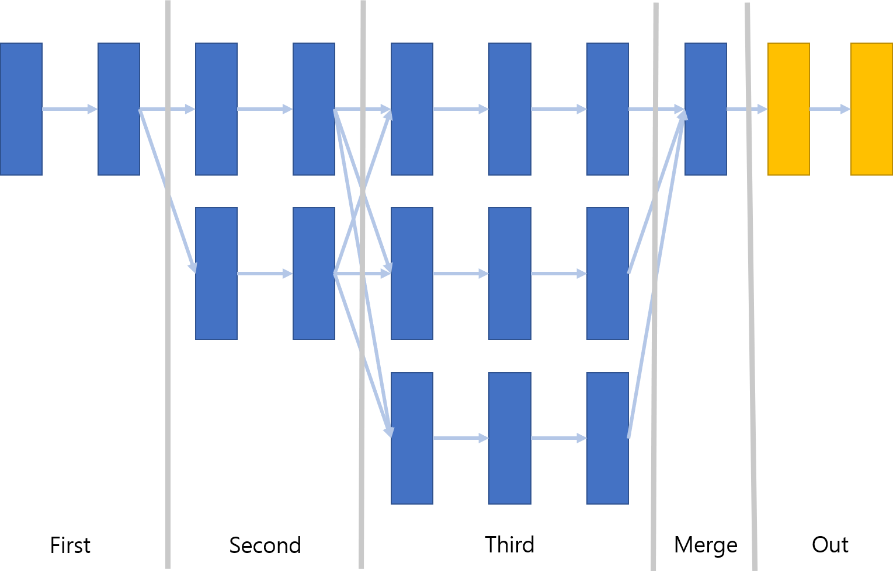
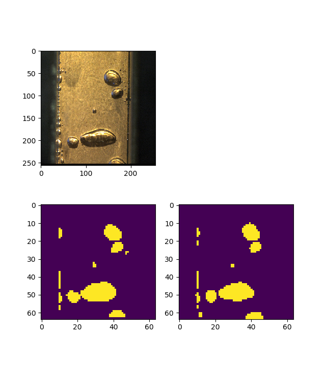
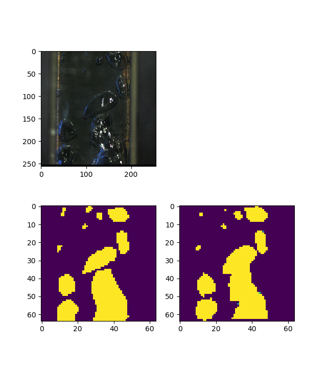
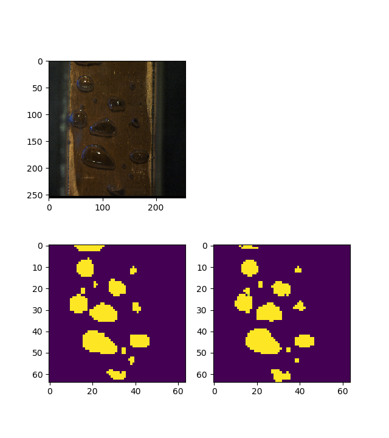
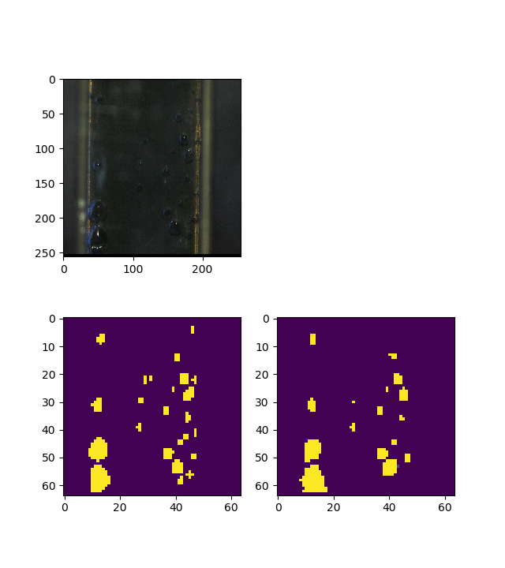

# HRNetTorch

This repository reimplemented [HRNet](https://arxiv.org/abs/1908.07919)

this model divided 3 part to  1, 2, 3 floor.  
In split position, they have skip connections to each floors.

---

if you want take model, you need to clone the submodule of torch_module. For some blocks.
you can change models depth and output channel. and may be I will change the stucture of output to more scalable.

When I try using this model to detect segmentation, It worked.

Detect segmentation was for bubble in various environments.

Left is ground truth and right is prediction result.

It used output channel to 1. 

---

When you use model for joint prediction, you need change output channel to 17(pose) or 21(hand pose). 

---

## Tracking Result  

